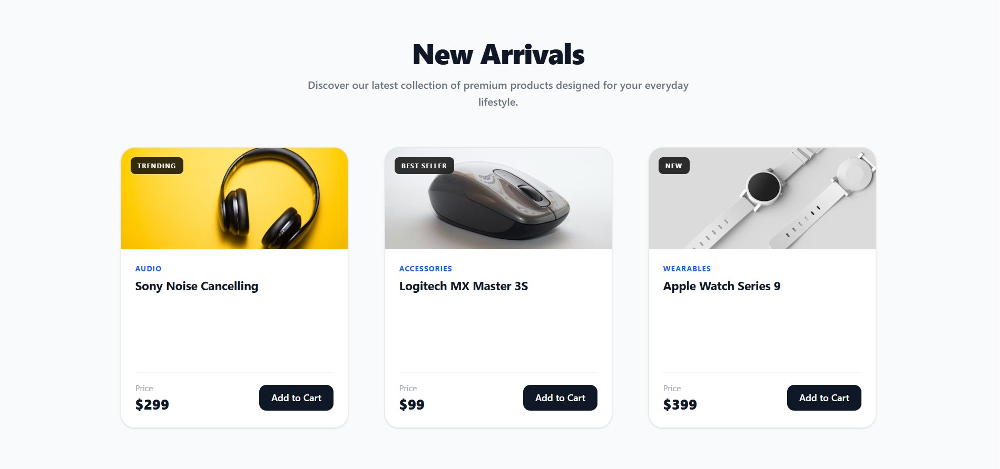

# 🛍️ React + Tailwind v4 Product Card UI

A modern, highly responsive, and modular Product Card component built using **React**, **Vite**, and **Tailwind CSS v4**. This project demonstrates a clean, component-based architecture for building scalable user interfaces.

<p align="center">
  
</p>

<p align="center">
  
  
  
  
</p>

## ✨ Features

- **Component-Based Architecture:** Code is split into reusable atomic components (`ProductCard`, `ProductImage`, `ProductInfo`, `Badge`).
- **Responsive Design:** Fully responsive grid layout that adapts to mobile, tablet, and desktop screens.
- **Modern UI/UX:** Clean aesthetics, rounded corners, soft shadows, and smooth hover animations.
- **Tailwind v4 Setup:** Utilizes the latest Tailwind CSS v4 setup directly configured with Vite.
- **Mock Data Handling:** Separated data mapping for real-world API simulation.

## 🛠️ Tech Stack

- **Framework:** [React](https://react.dev/)
- **Build Tool:** [Vite](https://vitejs.dev/)
- **Styling:** [Tailwind CSS v4](https://tailwindcss.com/)

## 📂 Folder Structure

```text
src/
├── components/
│   ├── ui/
│   │   └── Badge.jsx            # Reusable UI component
│   └── product/
│       ├── ProductImage.jsx     # Handles image and tags
│       ├── ProductInfo.jsx      # Handles text, price, and CTA
│       └── ProductCard.jsx      # Main wrapper combining image and info
├── App.jsx                      # Main application rendering the grid
├── main.jsx                     # React DOM entry point
└── index.css                    # Tailwind imports and base styles